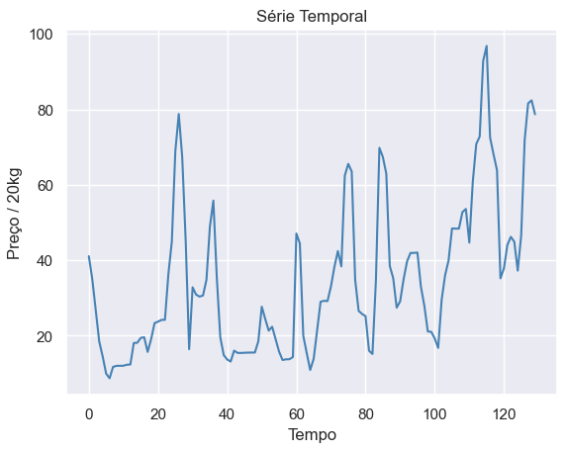

## Hi! I'm Cauã Elias
I'm a current student of Computer Science major in UFRJ (Universidade Federal do Rio de Janeiro)

## [Análise de Séries temporais](https://github.com/cauaedm/time_series_forecasting):

Esse projeto consiste-se em uma análise do mercado de produção agrícola da cebola, por meio da análise de uma série temporal do seu preço. Para realizar essa análise foram utilizadas técnicas de coleta de dados, limpeza de dados, análise de componentes da série, criação de modelos preditivos e validação dos modelos. Vale ressaltar que a proposta desse projeto não é realizar a melhor predição possível do preço, mas, analisar e gerar insights a partir dos dados. Para predição seria, talvez, mais válido a utilização de redes neurais e técnicas mais avançadas, caso tenha alguma sugestão, seria uma valiosa compartilhação.

## [Análise de Cotações da Pinha]([https://github.com/cauaedm/supermarket_history_analysis](https://github.com/cauaedm/pinha-analise/blob/main/README.md)):

Este projeto envolve a coleta de dados sobre as cotações da pinha, também conhecida como fruta do conde em algumas regiões, no estado da Bahia, utilizando técnicas de web scraping. Os dados foram extraídos de PDFs disponibilizados pelo CEASA da Bahia, que é uma fonte importante de informações sobre o mercado agrícola regional. A Bahia, como maior produtor nacional dessa fruta, oferece uma perspectiva valiosa para entender as variações de preços ao longo do tempo. Essa coleta de dados servirá como base para análises futuras, que explorarão as tendências de mercado, os fatores que influenciam as cotações e o impacto econômico da produção de pinha na região.
