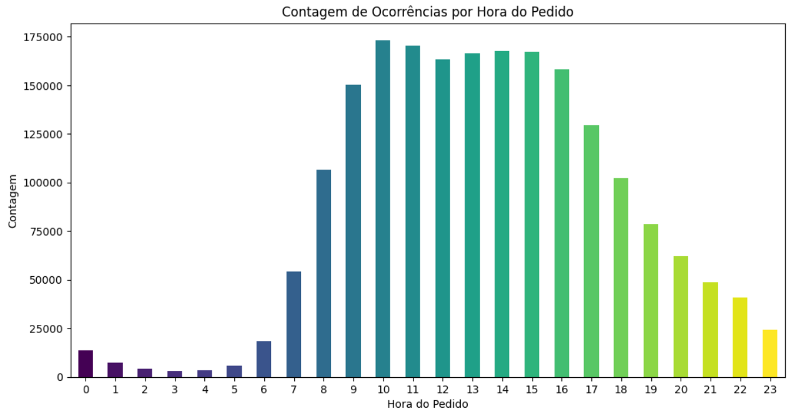

## Hi! I'm Cauã Elias
I'm a current student of Computer Science major in UFRJ (Universidade Federal do Rio de Janeiro)

## [Análise de Séries temporais](https://github.com/cauaedm/time_series_forecasting):

Esse projeto consiste-se em uma análise do mercado de produção agrícola da cebola, por meio da análise de uma série temporal do seu preço. Para realizar essa análise foram utilizadas técnicas de coleta de dados, limpeza de dados, análise de componentes da série, criação de modelos preditivos e validação dos modelos. Vale ressaltar que a proposta desse projeto não é realizar a melhor predição possível do preço, mas, analisar e gerar insights a partir dos dados. Para predição seria, talvez, mais válido a utilização de redes neurais e técnicas mais avançadas, caso tenha alguma sugestão, seria uma valiosa compartilhação.

## [Análise Exploratória de Dados - Supermarket user history](https://github.com/cauaedm/supermarket_history_analysis):

Esse projeto consiste em uma exploração dos dados, passando pelo tratamento de algumas variáveis, compreendendo seus funcionamentos e levantando hipóteses.

